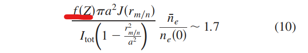

# Greenwald density limit

## 量纲分析

$$
n_e = \frac{I_p}{\pi a^2}
$$

左边量纲 $m^{-3}$，右边量纲 $A m^{-2}$

$$
m^{-3} \ne A m^{-2}
$$

Gates 2012 PRL 文章中，推导得到的密度极限是 
$$
n_e<\sqrt{\frac{m_e}{e^2 E_{\text {eff }}} \frac{\nu_{e i}}{\left(\nu_{e Z}\right)_{\text {eff }}}} J \quad \text { or } \quad n_e<f\left(Z, T_e\right) J \text {. }
$$
左边量纲 $m^{-3}$，右边量纲 $\sqrt{\frac{1}{\text{库伦}^2\text{米}^2\text{秒}^{-2}}} \frac{A}{m^2}=\frac{A\cdot\text{秒}}{m^3\cdot\text{库伦}}=m^{-3}$，量纲一致
在与  Greenwald DL 作对比时，是认为 $f\left(Z, T_e\right) J$ 是无量纲常数进行对比的

